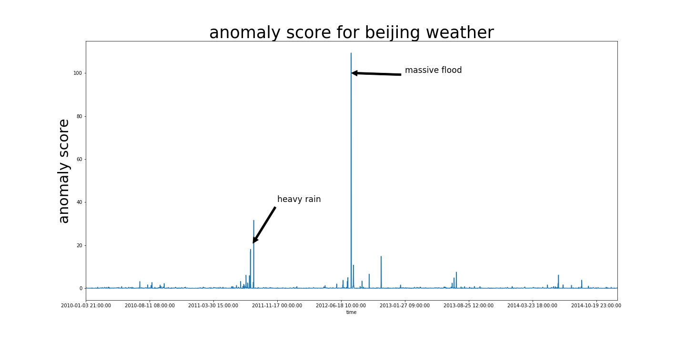

# Beijing Pollution and Weather Anomaly Detection using LSTM
 
This is a project I am working on during my free time applying some of the techniques I learned working at my current job as a data scientist. The goal of this project is to take the publically available Beijing weather data from 2010 to 2015 and apply anomaly detection techniques to see if we can discover weather and pollution extreme events without any labels. We can later verify the quality and performance of the model by investigating the time period that the model labels as anomalies. Similar techniques can be applied to other time series dataset.

## Data

I am using the Beijing weather and pollution data found [UCI Machine Learning Repo](https://archive.ics.uci.edu/ml/datasets/PM2.5+Data+of+Five+Chinese+Cities). The dataset contains the following features:
* year: year of data in this row 
* month: month of data in this row 
* day: day of data in this row 
* hour: hour of data in this row 
* season: season of data in this row 
* PM: PM2.5 concentration (ug/m^3) 
* DEWP: Dew Point (Celsius Degree) 
* TEMP: Temperature (Celsius Degree) 
* HUMI: Humidity (%) 
* PRES: Pressure (hPa) 
* cbwd: Combined wind direction 
* Iws: Cumulated wind speed (m/s) 
* precipitation: hourly precipitation (mm) 
* Iprec: Cumulated precipitation (mm)

## Model

I am building two models, one for catching anomalies in the weather in general, one for catching anomalies in the pollution specifically. 

## Results

### General Weather 

The model has identified '2010-02-14', '2010-02-15', '2010-03-22', '2010-03-23', '2012-01-23' as the days with the most anomalous weather, we can investigate what happened to access the performance of the model.

A quick search online reviewed that there was a [massive flood](https://en.wikipedia.org/wiki/July_2012_Beijing_flood) on 2012-07-21 in Beijing leading to the death of 79 people and caused 10 billion yuan worth of damage.

On 2011-08-26, heavy rain casued [flooding](http://www.chinadaily.com.cn/photo/2011-08/26/content_13198082.htm) in Beijing leading to traffic jams. There was no death reported and damage to infrastructure was not reported.

It appears that our model was able to catch large anamalies

### Pollution 

## Future Work
